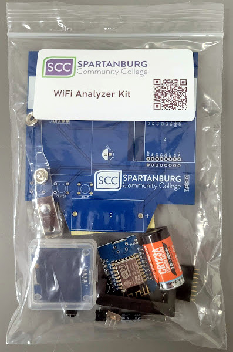

# SCC Wifi Scanner

  

# Overview
SCC Wifi Scanner is a custom electronics project for Spartanburg Community College's Computer Club, forked from the 2023 soldering village at [BSides 2023 Cybersecurity conference in Greenville, SC. ](https://github.com/circuitboardmedics/BSidesWifiScanner) 

This device is capable of scanning Wi-Fi networks, displaying the AP's MAC, the network's encryption type, as well as the current channel and RSSI.  It can also graphically display the signal strength of individual networks. The firmware features modular button handling, a timer for display fields, and a page manager for different UI screens.

# Assembly
A soldering iron and basic soldering skills are required to assemble the kit, but no other special tools are needed.  

## Diagram
Follow the diagram below for component placement. 

## Tips
1. Suggested soldering order: `U2`, `U1`, `Buttons`, `C1`, `SW0`, `BT1`

1. Polarity (Orientation) of `BT1`, `C1`, and `U2` matters; follow the diagram for placement.  The Capacitor C1 has white stripe on one side that should align with the white marking on the board.

1. Install the battery into the clip LAST, so as to avoid any short circuits during assembly.
   
1. Clip the long legs off the capacitor once soldered so they do not short to each other or anything else.

1. Residue left from soldering can be cleaned with Isopropyl alcohol.

1. The optional female headers can be used instead of mounting `U2` directly to the board, in order to make it removable.  Alternatively, they can be mounted adjacent to `U2` to provide access to the GPIO pins of the microcontroller.

## Video

_(note that the capacitor is shown installed backwards in the video. the white stripe should align with the white marking on the pcb)_

## Component Bill Of Materials:
- [1.3 Inch IIC I2C OLED Display Module 128x64 Pixel SH1106 Screen Module](https://www.amazon.com/gp/product/B0C3L7N917/) (U1)
- [WeMos D1 Mini microcontroller](https://www.amazon.com/s?k=wemos+d1+mini) (U2)
- [SPST Micro Switch](https://www.amazon.com/gp/product/B07BD1SPYG) (SW0)
- 1 [Tactile momentary switch 6x6x5 mm](https://www.amazon.com/gp/product/B01CGMP9G) (Left, Center, Right)
- ~100uF Electrolytic capacitor (C1)
- CR123 Battery (BT1)

## PCB
KiCad design files for the PCB, including schematic, are included in the pcb folder.

# Programming 
The microcontrollers are pre-flashed with the WiFi scanner firmware, but can be re-programmed with any other custom firmware following the tutorial below.

## Prerequisites
- USB Micro cable
- Visual Studio Code
- PlatformIO IDE extension
- ESP8266 or compatible board

## Setup Environment Using Visual Studio Code and PlatformIO

1. **Install Visual Studio Code**: Download and install [Visual Studio Code](https://code.visualstudio.com/).

2. **Install PlatformIO**: Open Visual Studio Code, go to Extensions and search for "PlatformIO IDE". Install it.

3. **Clone the Repository**: Clone this repository to your local machine using Git.

4. **Open the Project**: Open Visual Studio Code and navigate to `File > Open Folder` and select the cloned repository folder.

5. **PlatformIO Initialization**: The repository contains a [`platformio.ini`](https://github.com/circuitboardmedics/BSidesWifiScanner/blob/main/platformio.ini) file that specifies the board and dependencies. PlatformIO should automatically recognize this.

6. **Install Dependencies**: PlatformIO will automatically install the required libraries specified in `platformio.ini`.

## Flashing the Code

1. **Select Environment**: In PlatformIO Home, select the environment that matches your board. The default in `platformio.ini` is `d1_mini`.

2. **Build the Project**: Click on the "Build" button (checkmark icon) in the PlatformIO toolbar at the bottom.

3. **Upload the Code**: After a successful build, click on the "Upload" button (right arrow icon) in the PlatformIO toolbar to flash the code to your board.

4. **Monitor Serial Output**: Optionally, you can open the Serial Monitor by clicking on the "Serial Monitor" button (plug icon) in the PlatformIO toolbar to view debug output.

# Usage
After flashing, the device will start scanning for Wi-Fi networks and display a graphical representation of the signal strength for individual networks. Use the buttons to navigate through different pages.

# Thank you

  
  

